# Recording App Integration Specification
## Love Retold Platform Integration

**Document Version:** 1.0  
**Date:** January 2025  
**Prepared for:** Recording App Development Team  
**Prepared by:** Love Retold Platform Team

---

## 1. Executive Summary

This document outlines the technical integration between the Love Retold main platform and the recording web application. The recording app serves as a frictionless capture interface for audio/video memories that feed into our couples' wedding story books.

### Key Integration Principles
- **Single Firebase Backend** - Both apps share one Firebase project
- **Zero-Friction Recording** - No user authentication required for recording
- **Real-Time Processing** - Immediate transcription and story creation
- **Clean Separation** - Recording app handles capture only; main platform handles all business logic

---

## 2. User Journey Overview

### 2.1 Complete User Flow

```mermaid
graph LR
    A[Couple sets preferences] --> B[Adds storytellers]
    B --> C[Selects prompts]
    C --> D[System sends prompt via Email/SMS]
    D --> E[Recipient clicks unique link]
    E --> F[RECORDING APP: Shows prompt]
    F --> G[RECORDING APP: Records video/audio]
    G --> H[RECORDING APP: Uploads to Firebase]
    H --> I[Main platform processes]
    I --> J[Transcription via Whisper]
    J --> K[Story appears in couple's dashboard]
```



### 2.2 Recording Session States

1. **Pending** - Link generated, prompt scheduled/sent
2. **Active** - User on recording page, not yet recorded
3. **Uploading** - Recording in progress, chunks uploading
4. **Processing** - Upload complete, awaiting transcription
5. **Completed** - Transcription done, story available
6. **Failed** - Error occurred, retry available
7. **Expired** - 365 days passed since prompt created
8. **Deleted** - Prompt removed by couple

---

## 3. Technical Architecture

### 3.1 System Overview

```
Main Platform (loveretold.com)
├── User Management
├── Prompt Queue Management
├── Story Curation
├── Transcription Processing
└── Firebase Functions

Recording App (record.loveretold.com)
├── Prompt Display
├── Video/Audio Capture
├── Chunked Upload
└── Status Updates

Shared Firebase Project
├── Firestore Database
├── Cloud Storage
├── Cloud Functions
└── Security Rules
```

### 3.2 Firebase Project Structure

```
Project ID: love-retold-production

Firestore Collections:
/users/{userId}
  - User account data
  - Preferences
  - Storytellers list

/prompts/{promptId}
  - Prompt text
  - Assigned storyteller
  - Scheduled time
  - Status

/recordingSessions/{sessionId}
  - Session metadata
  - Recording status
  - Upload progress
  - Transcription status

/stories/{storyId}
  - Final transcribed text
  - Video/audio reference
  - Edit history

Storage Buckets:
/users/{userId}/recordings/{sessionId}/
  - chunks/chunk_{n}.mp4
  - final/recording.mp4
  - thumbnail.jpg
```

---

## 4. What We Provide to Recording App

### 4.1 Unique Recording Link

**Format:** `https://record.loveretold.com/?session={SESSION_ID}`

**SESSION_ID Structure:**
```
{randomPrefix}-{promptId}-{userId}-{storytellerId}-{timestamp}
Example: x7k9m2q-prmt_abc123-usr_def456-stlr_ghi789-1704128400
```

### 4.2 Firebase Configuration

```javascript
// Shared Firebase config (provided separately for security)
const firebaseConfig = {
  apiKey: "...",
  authDomain: "love-retold-production.firebaseapp.com",
  projectId: "love-retold-production",
  storageBucket: "love-retold-production.appspot.com",
  messagingSenderId: "...",
  appId: "..."
};
```

### 4.3 Recording Session Data (via Firestore)

When recording app loads with SESSION_ID, query Firestore:

```javascript
// Recording app queries this document
firestore.collection('recordingSessions').doc(SESSION_ID)

// Document structure:
{
  sessionId: "x7k9m2q-prmt_abc123-usr_def456-stlr_ghi789-1704128400",
  promptId: "prmt_abc123",
  userId: "usr_def456",
  storytellerId: "stlr_ghi789",
  storytellerName: "Mom",
  coupleNames: "Sarah & John",
  promptText: "How did you first meet the bride?",
  status: "pending", // pending | recording | completed | expired | deleted
  createdAt: Timestamp,
  expiresAt: Timestamp, // 365 days from creation
  maxDuration: 900, // 15 minutes in seconds
  videoQuality: "480p",
  allowAudio: true,
  allowVideo: true
}
```

---

## 5. What We Expect from Recording App

### 5.1 Core Functionality

**Your app should:**

1. **Parse SESSION_ID from URL parameter**
2. **Fetch session details from Firestore**
3. **Display appropriate UI based on status:**
   - Show prompt and record button if `status === "pending"`
   - Show "Already recorded" message if `status === "completed"`
   - Show "Link expired" if past `expiresAt`
   - Show "Prompt deleted" if `status === "deleted"`
4. **Handle recording with preview capability**
5. **Upload video/audio in chunks during recording**
6. **Update session status in Firestore**
7. **Show success confirmation after upload**

### 5.2 Data Flow Requirements

#### 5.2.1 On Recording Start
```javascript
// Update session status
await firestore.collection('recordingSessions').doc(SESSION_ID).update({
  status: 'recording',
  recordingStartedAt: firebase.firestore.FieldValue.serverTimestamp()
});
```

#### 5.2.2 During Recording (Chunked Upload)
```javascript
// Upload chunks to Storage as recording progresses
const chunkPath = `users/${userId}/recordings/${sessionId}/chunks/chunk_${chunkNumber}.mp4`;
const storageRef = storage.ref(chunkPath);
await storageRef.put(chunkBlob, {
  contentType: 'video/mp4',
  customMetadata: {
    sessionId: SESSION_ID,
    chunkNumber: chunkNumber.toString(),
    totalChunks: estimatedTotalChunks.toString()
  }
});

// Update upload progress (optional but recommended)
await firestore.collection('recordingSessions').doc(SESSION_ID).update({
  uploadProgress: percentComplete,
  lastChunkUploaded: chunkNumber
});
```

#### 5.2.3 On Recording Complete
```javascript
// Final storage path for assembled video
const finalPath = `users/${userId}/recordings/${sessionId}/final/recording.mp4`;

// Update session with completion data
await firestore.collection('recordingSessions').doc(SESSION_ID).update({
  status: 'processing', // Main platform will handle transcription
  recordingCompletedAt: firebase.firestore.FieldValue.serverTimestamp(),
  duration: recordingDurationInSeconds,
  fileSize: totalFileSize,
  mimeType: 'video/mp4', // or 'audio/webm' for audio only
  storagePath: finalPath,
  chunksCount: totalChunks,
  deviceInfo: { // Optional but helpful
    userAgent: navigator.userAgent,
    platform: navigator.platform
  }
});
```

### 5.3 Error Handling

```javascript
// On upload failure
await firestore.collection('recordingSessions').doc(SESSION_ID).update({
  status: 'failed',
  error: {
    code: 'UPLOAD_FAILED',
    message: 'Connection lost during upload',
    timestamp: firebase.firestore.FieldValue.serverTimestamp(),
    retryable: true
  }
});

// Common error codes to use:
// UPLOAD_FAILED - Network or storage issue
// QUOTA_EXCEEDED - File too large or duration exceeded
// INVALID_FORMAT - Unsupported media format
// SESSION_EXPIRED - Past 365 day limit
// SESSION_DELETED - Prompt was deleted
```

---

## 6. Security & Validation

### 6.1 What Recording App Should Validate

1. **Session Validity**
   - Check `expiresAt` hasn't passed
   - Verify `status` allows recording
   - Confirm session exists in Firestore

2. **Recording Constraints**
   - Maximum duration: 15 minutes
   - Maximum file size: 500MB
   - Allowed formats: video/mp4, video/webm, audio/webm

3. **Upload Safety**
   - Only upload to designated paths
   - Include session metadata with chunks
   - Verify chunk upload success before proceeding

### 6.2 Firebase Security Rules (We Will Implement)

```javascript
// Storage Rules - Recording app can write, main app can read
match /users/{userId}/recordings/{sessionId}/{allPaths=**} {
  allow write: if request.auth == null  // Anonymous uploads allowed
    && resource == null  // Creating new file
    && request.resource.size < 500 * 1024 * 1024; // 500MB max
  allow read: if request.auth.uid == userId; // Only owner can read
}

// Firestore Rules - Recording app can read session and update status
match /recordingSessions/{sessionId} {
  allow read: if true; // Anyone with link can read
  allow update: if request.auth == null // Anonymous updates allowed
    && request.resource.data.status in ['recording', 'processing', 'failed']
    && resource.data.status in ['pending', 'recording', 'failed']; // Status progression
}
```

---

## 7. Assumptions About Your Current Implementation

Based on our understanding, we assume your recording app currently:

1. **Handles media capture** using WebRTC or MediaRecorder API
2. **Provides preview/re-record** functionality before final submission
3. **Implements chunked upload** for progressive transfer
4. **Shows upload progress** to users
5. **Works across devices** (mobile and desktop browsers)
6. **Handles network interruptions** gracefully

**Please confirm or correct these assumptions.**

---

## 8. Integration Timeline & Testing

### 8.1 Proposed Integration Steps

1. **Week 1**: Recording app team reviews this spec and provides feedback
2. **Week 2**: We provide Firebase project access and credentials
3. **Week 3**: Recording app implements Firestore integration
4. **Week 4**: Joint testing with test prompts
5. **Week 5**: Production deployment

### 8.2 Test Scenarios We'll Validate Together

- [ ] Happy path: Click link → Record → Upload → Transcribe → View story
- [ ] Re-recording: User wants to redo their recording
- [ ] Network interruption: Connection lost mid-upload
- [ ] Session expiry: Attempting to use expired link
- [ ] Deleted prompt: Accessing removed prompt
- [ ] Multiple devices: Starting on desktop, switching to mobile
- [ ] Large files: 15-minute maximum duration recording
- [ ] Concurrent access: Multiple people with same link

### 8.3 Test Environment

We'll provide:
- Staging Firebase project: `love-retold-staging`
- Test SESSION_IDs for various scenarios
- Monitoring dashboard access

---

## 9. Questions for Recording App Team

1. **Current State**: What recording libraries/APIs are you using? (MediaRecorder, WebRTC, third-party?)

2. **Chunking Strategy**: How are you implementing chunked uploads? Size-based or time-based chunks?

3. **Browser Support**: Which browsers/versions are you targeting?

4. **Error Recovery**: How do you handle partial upload recovery currently?

5. **Firebase Experience**: Is your team familiar with Firebase SDK, or would you prefer REST API endpoints?

6. **Deployment**: Can you deploy to a subdomain (record.loveretold.com) or do you need a separate domain?

7. **Timeline**: What's your current development status and when could integration begin?

8. **Constraints**: Any technical limitations we should know about?

---

## 10. Support & Communication

### Development Support
- **Technical Contact**: [Your contact info]
- **Slack Channel**: #recording-app-integration
- **Documentation**: [Link to API docs]

### Monitoring & Debugging
- Firebase Console access will be provided for:
  - Viewing Firestore collections
  - Monitoring Storage uploads
  - Checking Function logs

### Change Management
- All API changes will be versioned
- 2-week notice for breaking changes
- Staging environment for testing

---

## Appendix A: Example Code Snippets

### Complete Session Handling Example

```javascript
// recording-app.js - Suggested implementation

import { initializeApp } from 'firebase/app';
import { getFirestore, doc, getDoc, updateDoc } from 'firebase/firestore';
import { getStorage, ref, uploadBytesResumable } from 'firebase/storage';

// Initialize Firebase (config provided separately)
const app = initializeApp(firebaseConfig);
const db = getFirestore(app);
const storage = getStorage(app);

class RecordingSession {
  constructor(sessionId) {
    this.sessionId = sessionId;
    this.sessionData = null;
  }

  async initialize() {
    // Fetch session from Firestore
    const sessionRef = doc(db, 'recordingSessions', this.sessionId);
    const sessionSnap = await getDoc(sessionRef);
    
    if (!sessionSnap.exists()) {
      throw new Error('SESSION_NOT_FOUND');
    }
    
    this.sessionData = sessionSnap.data();
    
    // Validate session status
    if (this.sessionData.status === 'completed') {
      throw new Error('ALREADY_RECORDED');
    }
    
    if (new Date() > this.sessionData.expiresAt.toDate()) {
      throw new Error('SESSION_EXPIRED');
    }
    
    if (this.sessionData.status === 'deleted') {
      throw new Error('PROMPT_DELETED');
    }
    
    return this.sessionData;
  }

  async startRecording() {
    await updateDoc(doc(db, 'recordingSessions', this.sessionId), {
      status: 'recording',
      recordingStartedAt: serverTimestamp()
    });
  }

  async uploadChunk(chunkBlob, chunkNumber) {
    const chunkPath = `users/${this.sessionData.userId}/recordings/${this.sessionId}/chunks/chunk_${chunkNumber}.mp4`;
    const storageRef = ref(storage, chunkPath);
    
    const uploadTask = uploadBytesResumable(storageRef, chunkBlob, {
      contentType: 'video/mp4',
      customMetadata: {
        sessionId: this.sessionId,
        chunkNumber: chunkNumber.toString()
      }
    });
    
    return uploadTask;
  }

  async completeRecording(duration, totalChunks) {
    await updateDoc(doc(db, 'recordingSessions', this.sessionId), {
      status: 'processing',
      recordingCompletedAt: serverTimestamp(),
      duration: duration,
      chunksCount: totalChunks
    });
  }

  async handleError(errorCode, errorMessage) {
    await updateDoc(doc(db, 'recordingSessions', this.sessionId), {
      status: 'failed',
      error: {
        code: errorCode,
        message: errorMessage,
        timestamp: serverTimestamp(),
        retryable: true
      }
    });
  }
}

// Usage
async function initializeRecordingPage() {
  const urlParams = new URLSearchParams(window.location.search);
  const sessionId = urlParams.get('session');
  
  if (!sessionId) {
    showError('No recording session specified');
    return;
  }
  
  try {
    const session = new RecordingSession(sessionId);
    const sessionData = await session.initialize();
    
    // Display prompt
    document.getElementById('prompt-text').textContent = sessionData.promptText;
    document.getElementById('couple-names').textContent = sessionData.coupleNames;
    document.getElementById('storyteller-name').textContent = sessionData.storytellerName;
    
    // Set up recording
    setupRecordingInterface(session);
    
  } catch (error) {
    switch(error.message) {
      case 'SESSION_NOT_FOUND':
        showError('This recording link is invalid');
        break;
      case 'ALREADY_RECORDED':
        showError('This memory has already been recorded');
        break;
      case 'SESSION_EXPIRED':
        showError('This recording link has expired');
        break;
      case 'PROMPT_DELETED':
        showError('This prompt has been removed');
        break;
      default:
        showError('An error occurred. Please try again.');
    }
  }
}
```

---

## Appendix B: Response Format

Please provide your feedback in the following structure:

1. **Assumptions Confirmation**: Which of our assumptions about your current implementation are correct/incorrect?

2. **Technical Clarifications**: Any questions about the proposed architecture?

3. **Implementation Concerns**: Any challenges you foresee with this approach?

4. **Timeline Feasibility**: Can you meet the proposed timeline?

5. **Preferred Communication**: How should we collaborate during development?

6. **Additional Requirements**: Anything we've missed that you need from us?

---

**End of Document**

Version History:
- v1.0 - Initial specification (January 2025)